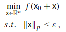

# Paper 1: FW - Revisiting Frank-Wolfe: Projection-Free Sparse Convex Optimization
Take aways:
- Convergence of normal FW and novel varient
- Uses duality gap certificates to create better convergence where approximate solutions to the LMO are acceptable  
- Adversarial tacks are as structured norm problem, meaning we can use a special LMO to exploit this structure.

Surrogate Duality Gap:
$$g(x):=\max_{s\in D} \langle x - s, \nabla f(x)\rangle$$
Satisifies definition of dual by convexity and falling under first order approximation of cost: $f(x) + \langle x - s, \nabla f(x)\rangle$.  

Point: FW vs projected gradient comparison. FW subproblems are linear proj grad problems are quadratic.

# Paper 2: FW_variants - On the Global Linear Convergence of Frank-Wolfe Optimization Variants

# Paper 3: FW_survey - Frank–Wolfe and friends: a journey into projection-free first-order optimization methods
- Paper by Rinaldi, et. al.  
- covers stepsizes in section 4.  
- Defines the AA problem in section 3.5  
Maximum allowable $\ell_p$-norm attack  
  
Targeted attack: push $x_0$ to target class. Untargeted attack: push $x_0$ away from correct class.

This is where he sayes we should take our problem forumulation from, but this is very general: It does not say which norm we should use, or if it should be targeted. The choice of norm effects what LMO to use, but for targeted/untargeted I suppose there's no reason we can't present results for both.  
The does say that we're creating adversarial *examples*, so perturbations are on one example $x_0$ unstead of a universal attack. This may be different in some of the other papers, though.

Choice of LMO (Taken from GPT, need to verify with theory)  
- $L_1$: $v_t = \epsilon \text{ sign}(\nabla f(x_t))_i$ where $i = \arg \max_i |\nabla f(x_t)_i|$  
this focuses on a single coordinate at a time.
- $L_2$: $v_t= \epsilon \frac{\nabla f(x_t)}{||\nabla f(x_t)||_2}$  
Projects gradient onto $L_2$ ball.
- $L_\infty$: $v_t = \epsilon \cdot \text{sign}(\nabla f(x_t))$  
Subproblem becomes instance of Fast Signed Gradient Problem (FGSM). But frank-wolfe creates convex combination.